# TaskFlow Architecture Overview

## System Architecture

```mermaid
graph TB
    subgraph Client["CLIENT LAYER (React 18 + Vite)"]
        Browser["Browser :5173"]
        Router["React Router"]
        App["App.jsx (Layout + Routes)"]

        subgraph Pages["Pages"]
            Dashboard["Dashboard"]
            Projects["Projects"]
            Tasks["Tasks"]
            Team["Team"]
            Settings["Settings"]
        end

        subgraph Components["Reusable Components"]
            Common["Common: Button, Modal, Badge, Spinner"]
            DashComp["Dashboard: Stats, RecentActivity"]
            ProjComp["Projects: ProjectList, ProjectCard, ProjectForm"]
            TaskComp["Tasks: TaskBoard, TaskRow, TaskForm, StatusBadge"]
            TeamComp["Team: MemberList, MemberCard"]
        end

        subgraph Hooks["Custom Hooks"]
            UseApi["useApi (generic fetch)"]
            UseTasks["useTasks (task-specific + filters)"]
            UseTeam["useTeam (team wrapper)"]
        end

        ApiClient["api-client.js (fetch wrapper)"]
    end

    subgraph Server["SERVER LAYER (Express.js :3001)"]
        Express["index.js"]

        subgraph Middleware["Middleware"]
            CORS["CORS"]
            Logger["Logger"]
            MockAuth["Mock Auth (user injection)"]
            ErrHandler["Error Handler"]
        end

        subgraph Routes["API Routes"]
            TeamAPI["/api/team"]
            ProjectAPI["/api/projects"]
            TaskAPI["/api/tasks"]
            SettingsAPI["/api/settings"]
        end
    end

    subgraph Database["DATABASE LAYER (SQLite)"]
        DBConn["connection.js (better-sqlite3)"]

        subgraph Tables["Tables"]
            TeamTable["team_members"]
            ProjectsTable["projects"]
            TasksTable["tasks"]
            SettingsTable["settings"]
        end
    end

    Browser --> Router --> App --> Pages
    Pages --> Components
    Pages --> Hooks
    Components --> Hooks
    Hooks --> ApiClient
    ApiClient -->|"HTTP/JSON"| Express
    Express --> Middleware --> Routes
    Routes --> DBConn --> Tables
```



### How the Layers Connect

**Client (what users see):** React app served by Vite on port 5173. Pages render components, which use custom hooks for data. All API calls go through `api-client.js`, which prefixes requests with `/api` and proxies them to the server.

**Server (logic + data):** Express app on port 3001. Requests pass through middleware (CORS, logging, mock auth injection), then hit route handlers that query the database and return JSON.

**Database (storage):** SQLite via better-sqlite3. Auto-creates and seeds on first run. WAL mode enabled for concurrency. Foreign keys enforced.

### Frontend Routing (App.jsx)

| Route | Page | Description |
|-------|------|-------------|
| `/` | Dashboard | Stats overview + recent activity |
| `/projects` | Projects | Project list with CRUD |
| `/tasks` | Tasks | Task list/board with filtering |
| `/team` | Team | Team member cards |
| `/settings` | Settings | App settings |

**Known bug:** Sidebar NavLink points to `/setting` (missing 's') but route is `/settings`.

### API Endpoints

| Method | Endpoint | Purpose |
|--------|----------|---------|
| GET | `/api/team` | List all team members |
| GET | `/api/team/:id` | Single team member |
| GET | `/api/team/:id/tasks` | Tasks assigned to member |
| GET | `/api/projects` | List projects with task counts |
| GET | `/api/projects/:id` | Single project + its tasks |
| POST | `/api/projects` | Create project |
| PUT | `/api/projects/:id` | Update project |
| DELETE | `/api/projects/:id` | Delete project (cascades tasks) |
| GET | `/api/tasks` | List tasks (filterable by status, priority, assignee, project) |
| GET | `/api/tasks/:id` | Single task with joined names |
| POST | `/api/tasks` | Create task |
| PUT | `/api/tasks/:id` | Update task (partial updates) |
| DELETE | `/api/tasks/:id` | Delete task |
| GET | `/api/settings` | Get all settings |
| PUT | `/api/settings` | Upsert settings |

### Database Schema

| Table | Key Columns | Constraints |
|-------|-------------|-------------|
| **team_members** | id, name, role, email, avatar_color | Unique email |
| **projects** | id, name, description, status, owner_id | FK to team_members; status: active/completed/on-hold |
| **tasks** | id, title, status, priority, assignee_id, project_id, due_date, estimated_hours | FK to team_members + projects; status: todo/in-progress/in-review/done; priority: low/medium/high/urgent |
| **settings** | key, value | Key-value store |

---

## Tech Stack

### Core Frameworks

| Layer | Technology | Version | Purpose |
|-------|-----------|---------|---------|
| Frontend | React | 18.3.1 | UI framework |
| Routing | React Router DOM | 6.23.1 | Client-side routing |
| Bundler | Vite | 5.2.13 | Dev server + build |
| Backend | Express | 4.19.2 | REST API server |
| Database | better-sqlite3 | 11.1.2 | SQLite driver |
| Testing | Vitest | 1.6.0 | Test runner |
| Testing | @testing-library/react | 15.0.7 | Component tests |

### Development Tools

- **concurrently** — runs client + server from single `npm run dev`
- **Node --watch** — auto-restarts server on file changes
- **Vite proxy** — forwards `/api` requests from :5173 to :3001
- **ES Modules** — `"type": "module"` across all packages

### Configuration Files

| File | Purpose |
|------|---------|
| `client/vite.config.js` | Dev server (port 5173), API proxy, React plugin |
| `vitest.config.js` | Test environment (jsdom), setup file, test patterns |
| `server/db/schema.sql` | Table definitions + constraints |
| `server/db/seed.sql` | Sample data for development |

---

## UI Components & Design Patterns

### Design Token System

All styling uses CSS custom properties from `client/src/styles/tokens.css`. Never hardcode values.

**Brand:** `--color-primary` (#e63f02), `--color-accent` (#fcc403)
**Neutrals:** `--color-bg` (#fafafa), `--color-surface` (#ffffff), `--color-text` (#111827)
**Status:** success (#10b981), warning (#f59e0b), error (#ef4444), info (#3b82f6)
**Priority:** urgent (red), high (orange), medium (yellow), low (gray)
**Typography:** Outfit font, sizes xs–3xl, weights 300–700
**Spacing:** 8-point grid, `--space-1` (0.25rem) through `--space-16` (4rem)

### Styling Approach

**Inline styles with CSS variables.** No CSS modules, no styled-components. Components build style objects referencing tokens:
```jsx
style={{ color: 'var(--color-text)', padding: 'var(--space-4)' }}
```

### Reusable Components

| Component | Location | Purpose |
|-----------|----------|---------|
| **Button** | `components/common/Button.jsx` | 3 variants: primary, secondary, ghost. Optional small size. |
| **Badge** | `components/common/Badge.jsx` | Pill-shaped status/priority labels with automatic color mapping |
| **Modal** | `components/common/Modal.jsx` | Overlay dialog for forms. Max 500px width, scrollable. |
| **Spinner** | `components/common/Spinner.jsx` | Three-dot loading animation |
| **Stats** | `components/dashboard/Stats.jsx` | 4-column metrics grid |
| **RecentActivity** | `components/dashboard/RecentActivity.jsx` | Timeline of recent task updates |
| **ProjectCard** | `components/projects/ProjectCard.jsx` | Project with progress bar |
| **ProjectList** | `components/projects/ProjectList.jsx` | Auto-fill grid of ProjectCards |
| **ProjectForm** | `components/projects/ProjectForm.jsx` | Create/edit project form |
| **TaskBoard** | `components/tasks/TaskBoard.jsx` | 4-column kanban by status |
| **TaskRow** | `components/tasks/TaskRow.jsx` | Single task in list view |
| **TaskForm** | `components/tasks/TaskForm.jsx` | Full task create/edit form |
| **StatusBadge** | `components/tasks/StatusBadge.jsx` | Badge wrapper for task status |
| **MemberCard** | `components/team/MemberCard.jsx` | Avatar + name/role/email |
| **MemberList** | `components/team/MemberList.jsx` | Auto-fill grid of MemberCards |

### Custom Hooks

| Hook | File | Purpose |
|------|------|---------|
| **useApi** | `hooks/useApi.js` | Generic fetch: returns { data, loading, error, refetch } |
| **useTasks** | `hooks/useTasks.js` | Task-specific: adds filtering + updateTask() |
| **useTeam** | `hooks/useTeam.js` | Wrapper around useApi('/team') |

### Component Patterns for New Features

- **Cards:** white surface, 1px border, lg radius, sm shadow, space-6 padding
- **Grids:** `repeat(auto-fill, minmax(300px, 1fr))` for responsive layouts
- **Forms:** `.form-group` class, label above input, primary focus ring
- **Buttons:** primary for main action, ghost for cancel, secondary for alternatives

---

## Key Files Reference

| File | Purpose |
|------|---------|
| `client/src/main.jsx` | React app entry point |
| `client/src/App.jsx` | Layout, sidebar, routing |
| `client/src/utils/api-client.js` | Fetch wrapper (get/post/put/delete) |
| `client/src/styles/tokens.css` | Design system tokens |
| `client/src/styles/globals.css` | Base styles + layout classes |
| `server/index.js` | Express app, middleware stack, mock auth |
| `server/db/connection.js` | SQLite connection + auto-init |
| `server/db/schema.sql` | Table definitions |
| `server/routes/tasks.js` | Task CRUD endpoints |
| `server/routes/projects.js` | Project CRUD endpoints |
| `server/routes/teams.js` | Team member endpoints |

---

## Development Workflow

```bash
npm run install:all    # Install root + client + server deps
npm run dev            # Start client (:5173) + server (:3001)
npm run dev:client     # Client only
npm run dev:server     # Server only
npm test               # Run all tests (vitest)
cd server && npm run db:reset  # Reset database
```

---

## Known Issues

1. **Routing bug** (App.jsx): Sidebar NavLink to Settings points to `/setting` instead of `/settings`
2. **Stats typo** (Stats.jsx): "Completd Tasks" should be "Completed Tasks"
3. **ProjectList grid** (ProjectList.jsx): Uses `2fr` instead of `1fr` in grid template
4. **No validation** (projects.js): POST /api/projects accepts empty project names
5. **No authentication**: Mock hardcoded user, no real auth system
