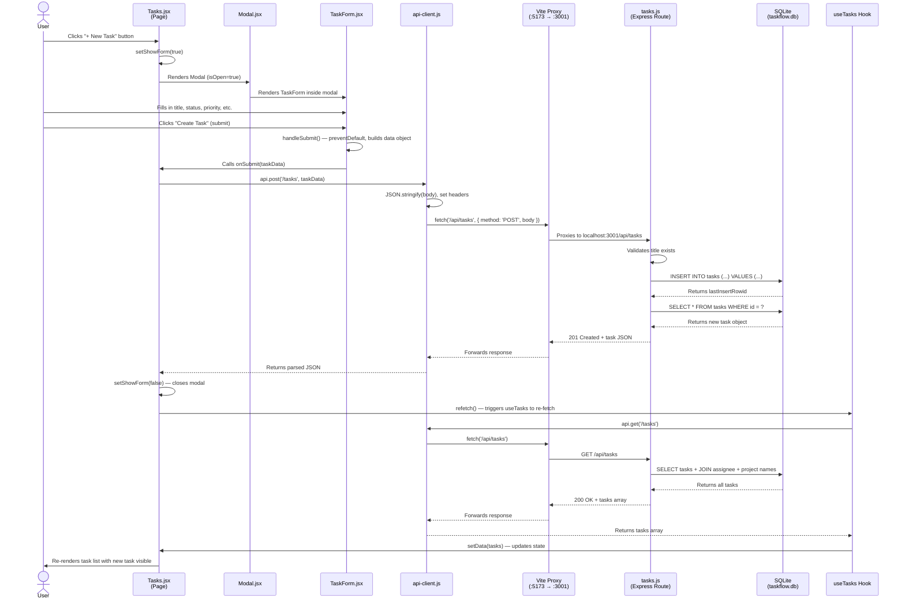

# Task Creation Flow — End to End

## Sequence Diagram



## Step-by-Step Walkthrough

### Step 1: User clicks "+ New Task"
**File:** `client/src/pages/Tasks.jsx` (line 52)

The Tasks page renders a Button that calls `setShowForm(true)` on click. This state change causes React to render a Modal component with `isOpen={true}`.

### Step 2: Modal opens with TaskForm
**Files:** `client/src/components/common/Modal.jsx` + `client/src/components/tasks/TaskForm.jsx`

The Modal renders a fixed overlay with a white dialog box. Inside it, TaskForm displays a form with fields for: title (required), description, status, priority, assignee, project, due date, and estimated hours. Team members and projects are passed as props for the dropdown selectors.

### Step 3: User fills form and submits
**File:** `client/src/components/tasks/TaskForm.jsx` (lines 14-26)

On submit, `handleSubmit()` prevents the default form action and builds a data object:
```javascript
{
  title,
  description,
  status,           // defaults to 'todo'
  priority,         // defaults to 'medium'
  assignee_id,      // null if unassigned
  project_id,       // null if no project
  due_date,         // null if not set
  estimated_hours,  // 0 if not set
}
```
This object is passed up to the parent via `onSubmit(taskData)`.

### Step 4: Tasks page sends API request
**File:** `client/src/pages/Tasks.jsx` (lines 34-38)

The `handleCreate` function calls `api.post('/tasks', taskData)` — an async POST request through the API client.

### Step 5: API client makes the HTTP call
**File:** `client/src/utils/api-client.js` (lines 3-25)

The API client prepends `/api` to make the URL `/api/tasks`, stringifies the body to JSON, sets the `Content-Type` header, and calls `fetch()`. The Vite dev server proxies this from port 5173 to Express on port 3001.

### Step 6: Server validates and inserts
**File:** `server/routes/tasks.js` (lines 61-85)

The Express route handler:
1. Extracts fields from `req.body`
2. Validates that `title` exists (returns 400 if missing)
3. Runs `INSERT INTO tasks` with the provided values (defaults for missing fields)
4. Queries the newly created task using `lastInsertRowid`
5. Returns the task object with status 201

### Step 7: Response flows back and UI updates
**Files:** `client/src/pages/Tasks.jsx` (lines 36-37) + `client/src/hooks/useTasks.js` (lines 16-27)

Back in the browser:
1. `api.post()` resolves with the new task
2. `setShowForm(false)` closes the modal
3. `refetch()` triggers the `useTasks` hook to re-fetch all tasks from GET `/api/tasks`
4. The hook updates its `data` state with the fresh task list
5. React re-renders the task list/board — new task is now visible

## Files Involved

| Layer | File | Role |
|-------|------|------|
| UI (page) | `client/src/pages/Tasks.jsx` | Orchestrates: button, modal, form, API call, refetch |
| UI (form) | `client/src/components/tasks/TaskForm.jsx` | Collects user input, validates title |
| UI (modal) | `client/src/components/common/Modal.jsx` | Overlay container for the form |
| Data layer | `client/src/hooks/useTasks.js` | Fetches task list, provides refetch() |
| Network | `client/src/utils/api-client.js` | HTTP wrapper (POST + JSON) |
| Proxy | `client/vite.config.js` | Forwards /api to :3001 |
| API | `server/routes/tasks.js` | Validates, inserts, returns task |
| Database | `server/db/connection.js` | SQLite connection |
